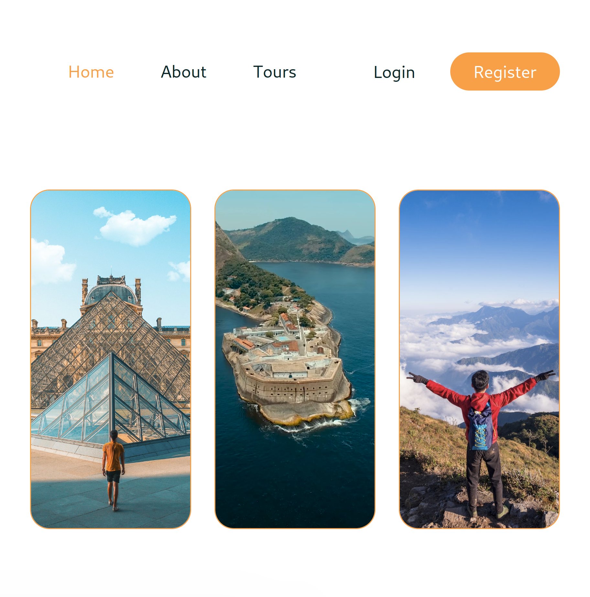

# Travel Agency Website

- **MERN project** with the ability to retrieve and update data from MongoDB database. 

- Fully functional website with Register/Login functionalities. 

- Tours searchable by location, distance, and/or max numbers of tourists.

- Book tours with auto-calculated total fees based on the tour, the number of persons and service fees. 

- Replaced Google Fonts with Coollabs alternatives for privacy concerns. 

## Technologies Used

- Frontend: react-router-dom; react-responsive-masonry; react-slick; reactstrap; remixicon; slick-carousel

- Backend: bcryptjs; cookie-parser; jsonwebtoken; cors

## How to Use

- At the Homepage, you can see what is expected of a normal travel booking website, with an brief introduction to TravelWorld, and a list of tours TravelWorld has to offer. You can click on a specific tour to view the details, and whatever comments that are already there. You will need an account to book your own tour and share your experience of your tours in the comments section. If you try to book a tour before you have signed in, you will be reminded to do so.

- Start by registering an account with TravelWorld with an email address and a password. At this stage, we are not requiring verification via email, so feel free to use a fake email account, simply for the purpose of exploring what TravelWorld has to offer. Your password will be salted and hashed by bcrypt.js.

- With your own account created, you can now log into the system. The authorization and information exchange processes are taken care by Jason Web Tokens. Your login will expire in seven days, which can be customized of course, or when you have cleared the cookies of the website, or when you have logged out yourself. 

- Now you can book your tours. But don't worry, we are not going to actually charge you for now. Just have a go and try to fill out the required information - your name, your phone number, your preferred date of travel, and the number of persons. You don't have to give out personal information, just make up something, but remember to respect the format, i.e. let names be names (or letters), dates be dates, and numbers be numbers. If the formats don't match, or some fields are left blank, the system will complain. If everything goes as required, then congratulations, your tour is booked. 

- And you can now make a comment. Give it a Star Rating from 1 to 5, and share with others whatever you feeling like sharing about your tour.

## What's Next

A lot more can be added to make the website more business ready. 

- Promotions and Coupons are typical marketing strategies. Old school maybe, but also very effective.

- Payments methods.

- Verification via email.

- Option to change login details (email, password, username, etc.)

- Tourists details that may be required to book hotels, flights, tickets, etc.

- A user should be able to make a comment on a tour if they have actually booked that tour and done it. 
